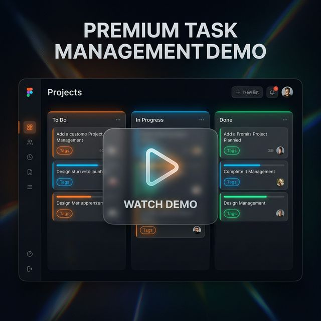

# Tasker - Task Management System

A full-stack task management application featuring a NestJS backend and a React Native (Expo) mobile frontend.

## 🚀 Features

- **Task Management**:
    - **Add Task**: Create new tasks with titles and optional descriptions.
    - **Task List**: View all tasks in a clean, scrollable list.
    - **Mark as Complete**: Toggle tasks between pending and completed states with visual status indicators.
    - **Delete Task**: Remove tasks from the system (available to admins).
- **User Authentication**: Secure sign-in and registration system.
- **Role-Based & Ownership Access**:
    - All users can create and view tasks.
    - Task creators can delete their own tasks.
    - Administrators have full control over all tasks.

## 📺 App Demos

Experience the app in action! Click the thumbnails below to view the high-quality demonstrations for each role.

| 👑 Admin Role | 👤 Tasker Role |
| :---: | :---: |
| [](assets/demo/admin.MP4) | [](assets/demo/tasker.MP4) |
| *Full control & oversight* | *Personal task management* |

> [!TIP]
> **Trouble viewing the videos?** GitHub may limit previews for large files. If the link above shows a "file too big" message, you can still download the video or view it locally using the setup instructions below.

---

## 🛠️ Technology Stack

### Backend
- **Framework**: [NestJS](https://nestjs.com/)
- **Database**: [PostgreSQL](https://www.postgresql.org/) with [TypeORM](https://typeorm.io/)
- **Auth**: [Passport.js](https://www.passportjs.org/) with JWT strategy
- **Validation**: [class-validator](https://github.com/typestack/class-validator) and [class-transformer](https://github.com/typestack/class-transformer)

### Mobile
- **Framework**: [React Native](https://reactnative.dev/) with [Expo](https://expo.dev/)
- **Navigation**: [React Navigation](https://reactnavigation.org/) (Stack & Bottom Tabs)
- **API Client**: [Axios](https://axios-http.com/)
- **Storage**: [Expo Secure Store](https://docs.expo.dev/versions/latest/sdk/securestore/) for token management

## 📦 Handling Large Files (Git LFS)

The demo videos in this repository are managed using **Git Large File Storage (LFS)** to ensure smooth performance and prevent GitHub preview issues.

If you are cloning this repository for the first time or having trouble viewing videos:
1. **Install Git LFS**: [Download here](https://git-lfs.github.com/) or run `brew install git-lfs`.
2. **Initialize LFS**:
   ```bash
   git lfs install
   ```
3. **Pull large files**:
   ```bash
   git lfs pull
   ```

---

## 🛠️ Setup and Installation

### Prerequisites
- Node.js (v18 or later)
- PostgreSQL database
- Expo Go app on your mobile device (to run the mobile app)

### 1. Backend Setup
1. Navigate to the `backend` directory:
   ```bash
   cd backend
   ```
2. Install dependencies:
   ```bash
   npm install
   ```
3. Configure environment variables:
   - Create a `.env` file in the `backend` directory.
   - Add your database configuration (host, port, username, password, database).
4. Run migrations (if applicable):
   ```bash
   npm run typeorm:migration:run
   ```
5. Start the development server:
   ```bash
   npm run start:dev
   ```

### 2. Mobile Setup
1. Navigate to the `mobile` directory:
   ```bash
   cd mobile
   ```
2. Install dependencies:
   ```bash
   npm install
   ```
3. Update the API base URL:
   - Locate `src/api/client.ts` and set the `baseURL` to your local backend IP address (e.g., `http://192.168.1.XX:3000`).
4. Start the Expo server:
   ```bash
   npm run start
   ```
5. Scan the QR code with the Expo Go app to view the app on your device.

## 📝 Usage Instructions
- **Sign Up**: Create a new account to get started.
- **Navigation**: Use the bottom tabs to switch between your tasks, all tasks, creating a new task, and your profile.
- **Task Actions**: Press a task in the list to view details, mark as complete, or delete it.